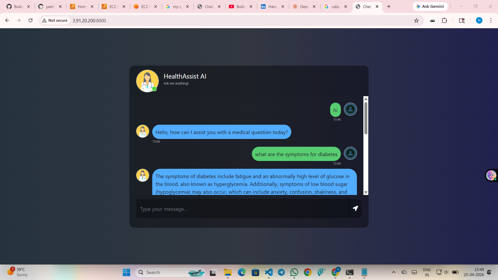
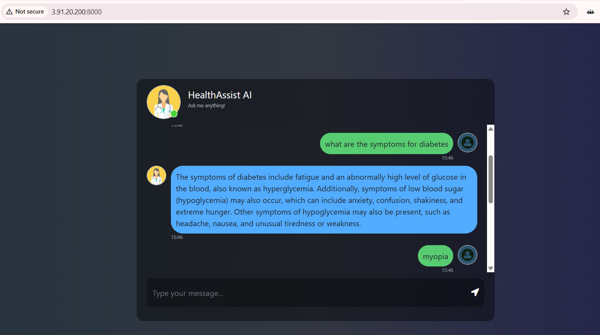
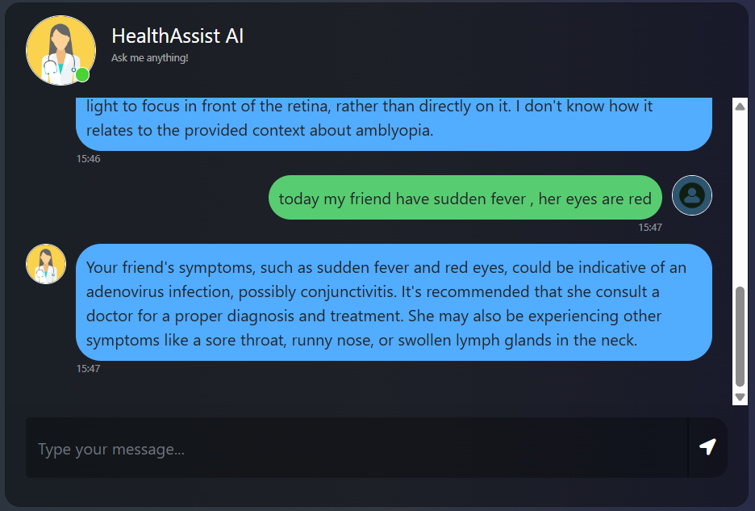

<h1 align="center">🏥 HealthAssist-AI</h1>

<p align="center">
  A production-grade medical question-answering chatbot powered by Retrieval-Augmented Generation (RAG),
  LangChain, Pinecone, and Llama 3.3 — deployed on AWS with a fully automated CI/CD pipeline.
</p>

<p align="center">
  
  
  
  
  
  
</p>

---

## 📽️ Demo


[](https://drive.google.com/file/d/1Wem9Z9uCFXOvjGCCLQazsQ55EIu31ccD/view?usp=drivesdk)
---

## 📸 Screenshots

<!-- Create an assets/ folder, upload screenshots, replace filenames below -->
| Chat Interface | Sample Query | Response |
|---|---|---|
|  |  |  |

---

## 🧠 What is this project?

HealthAssist-AI answers medical questions by combining a curated medical knowledge base with a large language model — without fine-tuning the model.

Instead of expensive fine-tuning, this project uses **Retrieval-Augmented Generation (RAG)**:

1. A 637-page medical textbook is chunked, embedded, and stored in Pinecone as vectors
2. When a user asks a question, the query is embedded using the same model
3. The top-3 most semantically similar chunks are retrieved via cosine similarity
4. Those chunks are injected as context into Llama 3.3 70B Versatile (via Groq), which generates a grounded answer

---

## 🏗️ Architecture

```
┌─────────────────────────────────────────────────────┐
│              PHASE 1 — Offline Ingestion             │
│                   (runs once)                        │
│                                                      │
│  PDF Book → Chunking → Sentence Transformer Embed   │
│             (500 tokens, 50 overlap)   (384-dim)     │
│                         ↓                           │
│                    Pinecone Index                    │
└─────────────────────────────────────────────────────┘

┌─────────────────────────────────────────────────────┐
│           PHASE 2 — Online Query (RAG)               │
│                                                      │
│  User → Flask UI → Embed Query → Pinecone           │
│                                    ↓ top-k=3         │
│                    LangChain RetrievalQA Chain       │
│                                    ↓                 │
│                Groq + Llama 3.3 70B Versatile        │
│                                    ↓                 │
│                         Answer to User               │
└─────────────────────────────────────────────────────┘
```

---

## ⚙️ Tech Stack

| Layer | Technology | Purpose |
|---|---|---|
| Language | Python 3.10 | Core language |
| LLM | Llama 3.3 70B Versatile via Groq | Answer generation |
| Orchestration | LangChain | RAG chain, prompt management |
| Embedding model | all-MiniLM-L6-v2 (HuggingFace) | Text → 384-dim vectors |
| Vector database | Pinecone (Serverless) | Semantic similarity search |
| Web framework | Flask | Frontend + API routes |
| Containerization | Docker | Reproducible deployments |
| Cloud | AWS EC2 + ECR | Production hosting |
| CI/CD | GitHub Actions | Automated deploy on push |

---

## 📁 Project Structure

```
HealthAssist-AI/
├── .github/
│   └── workflows/          # GitHub Actions CI/CD pipeline
├── data/                   # Medical PDF source (not tracked in git)
├── research/               # Experiment notebooks
├── src/
│   ├── helper.py           # PDF loading, chunking, embedding functions
│   └── prompt.py           # System prompt template for the LLM
├── static/                 # CSS and frontend assets
├── templates/
│   └── chat.html           # Chat UI
├── app.py                  # Flask app — RAG chain + routes
├── store_index.py          # One-time ingestion script
├── Dockerfile              # Container definition
├── requirements.txt        # Python dependencies
└── .env                    # API keys (never commit this)
```

---

## 🚀 How to Run Locally

### Prerequisites
- Python 3.10
- Conda
- Pinecone account (free tier works)
- Groq API key (free at [console.groq.com](https://console.groq.com))

### STEP 01 — Clone the repository

```bash
git clone https://github.com/haripriya1303/HealthAssist-AI.git
cd HealthAssist-AI
```

### STEP 02 — Create and activate a conda environment

```bash
conda create -n medibot python=3.10 -y
conda activate medibot
```

### STEP 03 — Install the requirements

```bash
pip install -r requirements.txt
```

### STEP 04 — Create a `.env` file in the root directory

```ini
PINECONE_API_KEY=your_pinecone_api_key_here
GROQ_API_KEY=your_groq_api_key_here
```

> ⚠️ Never commit your `.env` file. It is already listed in `.gitignore`.

### STEP 05 — Build the knowledge base (run once)

Place your medical PDF inside the `data/` folder, then:

```bash
python store_index.py
```

This chunks the PDF, generates embeddings, and uploads vectors to Pinecone.
If the index already has data, it skips the upload automatically.

### STEP 06 — Launch the app

```bash
python app.py
```

Open your browser at `http://localhost:8000`

---

## ☁️ AWS CI/CD Deployment with GitHub Actions

Every `git push` to `main` automatically builds, pushes, and redeploys the app.

### 1. Login to AWS console

### 2. Create IAM user for deployment

```
# With specific access:

1. EC2 access  — virtual machine to run the app
2. ECR access  — container registry to store Docker images

# Deployment flow:
1. Build Docker image from source code
2. Push Docker image to ECR
3. Launch EC2 instance
4. Pull image from ECR into EC2
5. Run Docker container on EC2

# IAM Policies required:
1. AmazonEC2ContainerRegistryFullAccess
2. AmazonEC2FullAccess
```

### 3. Create ECR repository to store the Docker image

```bash
# Save your ECR URI — you'll need it as a GitHub Secret
# Example format: <aws_account_id>.dkr.ecr.<region>.amazonaws.com/<repo-name>
```

### 4. Create EC2 machine (Ubuntu)

### 5. Install Docker on EC2

```bash
# Optional but recommended
sudo apt-get update -y
sudo apt-get upgrade -y

# Required
curl -fsSL https://get.docker.com -o get-docker.sh
sudo sh get-docker.sh
sudo usermod -aG docker ubuntu
newgrp docker
```

### 6. Configure EC2 as a self-hosted GitHub Actions runner

```
GitHub repo → Settings → Actions → Runners → New self-hosted runner
→ Choose OS → Run each command shown, one by one
```

### 7. Add GitHub Secrets

Go to `Settings → Secrets and variables → Actions` and add:

| Secret | Description |
|---|---|
| `AWS_ACCESS_KEY_ID` | IAM user access key |
| `AWS_SECRET_ACCESS_KEY` | IAM user secret key |
| `AWS_DEFAULT_REGION` | e.g. `us-east-1` |
| `ECR_REPO` | Your ECR repository URI |
| `PINECONE_API_KEY` | Pinecone API key |
| `GROQ_API_KEY` | Groq API key |

Once secrets are configured, every push to `main` triggers:
**Build Docker image → Push to ECR → Pull on EC2 → Restart container**

---

## 🔑 Key Design Decisions

**Why RAG instead of fine-tuning?**
Fine-tuning requires massive compute, labeled data, and full retraining whenever knowledge changes. RAG keeps the model frozen and retrieves domain knowledge at query time — cheaper, faster to update, and preserves general reasoning ability.

**Why Groq over OpenAI?**
Groq's LPU hardware delivers ~10x faster inference. Since Groq exposes an OpenAI-compatible API, switching required zero LangChain code changes — just a different `base_url` and key.

**Why `temperature=0`?**
Medical responses must be factual and deterministic. Temperature controls randomness — setting it to 0 ensures the model always picks the most grounded response, reducing hallucination risk.

**Why `chunk_size=500` with overlap?**
The LLM has a token limit per request. Chunking splits the 637-page book into retrievable units. Overlap of 50 tokens ensures facts spanning chunk boundaries are never lost.

---

## 🛠️ Future Improvements

- [ ] Add conversation memory for multi-turn context awareness
- [ ] Replace Flask dev server with `gunicorn` for production
- [ ] Add relevance score threshold to filter low-confidence chunks
- [ ] Add `.dockerignore` to exclude `data/` from Docker image
- [ ] Input validation on the `/get` route for empty query handling
- [ ] Re-ranking step using a cross-encoder for higher retrieval precision

---

## 📄 License

This project is licensed under the Apache 2.0 License. See [LICENSE](LICENSE) for details.

---

<p align="center">Made by <a href="https://github.com/haripriya1303">Haripriya</a></p>